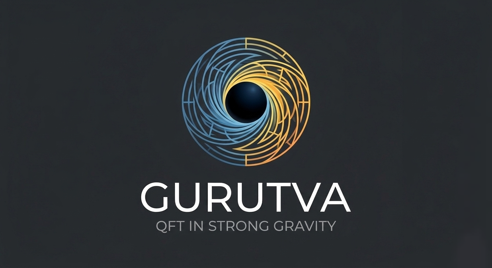

# Gurutva

**Gurutva** is a Python library for studying **quantum field theory in curved spacetime and strong gravity**.

The goal of this project is to provide tools for symbolic and numerical calculations involving spacetime geometry, quantum fields, and particle creation in gravitational backgrounds.

The name *Gurutva* (ଗୁରୁତ୍ୱ) comes from Odia/Sanskrit and means **gravity**.

---

## Features

Current and planned capabilities include:

### Spacetime Geometry

* Minkowski spacetime
* Schwarzschild spacetime
* Kerr spacetime
* Reissner–Nordström spacetime

### Differential Geometry Tools

* Metric tensors
* Inverse metrics
* Determinants
* Christoffel symbols
* Ricci tensor
* Ricci scalar

### Quantum Field Theory (Planned)

* Scalar field dynamics
* Mode decomposition
* Particle creation in curved spacetime
* Hawking radiation calculations

### Physical Constants

* Fundamental constants (SI units)
* Planck scale quantities
* Astronomical constants

---

## Installation

Clone the repository:

```bash
git clone https://github.com/sk-panigrahi/gurutva.git
cd gurutva
```

Create and activate a virtual environment:

```bash
python -m venv .venv
source .venv/bin/activate
```

Install dependencies:

```bash
pip install -r requirements.txt
```

---

## Example Usage

Example: Computing the Ricci scalar of a spacetime.

```python
from gurutva.spacetimes.schwarzschild import Schwarzschild

M = 1
spacetime = Schwarzschild(M)

R = spacetime.ricci_scalar()
print(R)
```

---

## Project Structure

```
gurutva/
│
├── gurutva/
│   ├── constants.py
│   │
│   ├── spacetimes/
│   │   ├── base.py
│   │   ├── minkowski.py
│   │   ├── schwarzschild.py
│   │   ├── kerr.py
│   │   └── reissner_nordstrom.py
│   │
│   ├── Fields
│   │   ├── base.py
│   │   ├── scalar.py
│   │   ├── vector.py
│   │   └── tensor.py
│   │
│   ├── Particles
│   │   ├── base.py
│   │   ├── bosons/ 
│   │   └── fermions/
│   │
│   └── utils
│       └── tensor_op.py
│
├── examples/
├── tests/
├── README.md
└── pyproject.toml
```

---

## Goals of the Project

The long-term goal of **Gurutva** is to build a framework capable of studying phenomena such as:

* quantum fields near black holes
* Hawking radiation
* particle production in curved spacetime
* semiclassical gravity

---

## Dependencies

The core library relies on:

* Python 3.10+
* NumPy
* SymPy
* SciPy

---

## Contributing

Contributions are very welcome!
This project is an ongoing effort to build a flexible and powerful framework for studying gravity and quantum fields.

### A note from the author


I am currently a Master's student and still learning many aspects of quantum field theory and general relativity. Many of the concepts implemented here are things I am actively studying and exploring.

Because of this, I would genuinely appreciate:

- suggestions for better design or physics implementations  
- corrections if something is incorrect or incomplete  
- collaboration in shaping this library into something meaningful  

If you have expertise in this area, your input would be incredibly valuable in helping move this project forward.


---

## License

This project is released under the MIT License.

---

## Author

Suraj Kumar Panigrahi

### Contact

Feel free to reach out for collaboration, discussion, or suggestions:
- **Email:** *panigrahi.sku@gmail.com*
- **Linkedin:** *[Suraj Kumar Panigrahi](https://www.linkedin.com/in/surajkpanirahi?utm_source=share_via&utm_content=profile&utm_medium=member_android)*

